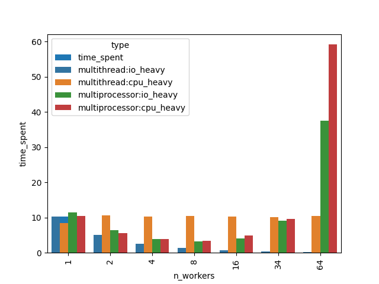

# Multi Threading and Processing

In this article, we will learn the what, why, and how of multithreading and multiprocessing in Python. Before we dive into the code, let us understand what these terms mean.

A program is an executable file which consists of a set of instructions to perform some task and is usually stored on the disk of your computer.
A process is what we call a program that has been loaded into memory along with all the resources it needs to operate. It has its own memory space.
A thread is the unit of execution within a process. A process can have multiple threads running as a part of it, where each thread uses the process’s memory space and shares it with other threads.

Multithreading is a technique where multiple threads are spawned by a process to do different tasks, at about the same time, just one after the other. This gives you the illusion that the threads are running in parallel, but they are actually run in a concurrent manner. In Python, the Global Interpreter Lock (GIL) prevents the threads from running simultaneously.

Multiprocessing is a technique where parallelism in its truest form is achieved. Multiple processes are run across multiple CPU cores, which do not share the resources among them. Each process can have many threads running in its own memory space. In Python, each process has its own instance of Python interpreter doing the job of executing the instructions.

| Multithreading in Python                                                                | Multiprocessing in Python                                                        |
| --------------------------------------------------------------------------------------- | -------------------------------------------------------------------------------- |
| It Implements the Concurrency.                                                          | It Implements the Parallelism.                                                   |
| Python does not support multithreading in the case of parallel computing.               | Python supports multiprocessing in the case of parallel computing.               |
| In multithreading, multiple threads at the same time are generated by a single process. | In multiprocessing, multiple threads at the same time run across multiple cores. |
| Multithreading can not be classified.                                                   | Multiprocessing can be classified such as symmetric or asymmetric.               |

## PoC (Proof of Concept) setup

At a high-level, was created a simulation in the following steps:

- Create two functions to mimic IO-heavy and CPU-heavy tasks.
- Create a “hub” function to simulate executing a task 100 times, under different parallelization settings using “concurrent.futures” module.
- use Python’s “timeit” function to execute the “hub” function for 5 times to get an average time spent measure under the given parallelization setting.

Was evaluated from 1 to 8 "workers" varying threads and processes.

Here are some findings that one can easily see on the graph:

- "Multithreading" and "Multiprocessing" are equally effective on heavy IO tasks. With more workers, the time spent on total tasks decreases from ~10 seconds (1 worker) to 1.3 seconds (8 workers), which is about an 8X speed increase.

- "Multithreading" does not work well on heavy CPU tasks. The red bar graph shows that regardless of how many "threads" are used, the total time spent is consistently about 10 seconds.

- "Multithreading" is effective on CPU heavy tasks, however it plateaus under hardware limits. In my case, it's when the number of workers is ≥ 5, your max speed boost is still 5X (~2 seconds), less than your actual number of workers (eg 6, 7, 8). This is because my laptop has 6 cores, and since the system requires 1 core to maintain its functions, the remaining 5 cores can be used for computing, thus the maximum speed increase is 5X.

Then it was evaluated from `[1, 2, 4, 8, 16, 34, 64]` "workers" varying threads and processes.

## References

[Differences between the threading and multiprocessing](https://stackoverflow.com/questions/18114285/what-are-the-differences-between-the-threading-and-multiprocessing-modules)
[Multithreading vs multiprocessing in python](https://medium.com/contentsquare-engineering-blog/multithreading-vs-multiprocessing-in-python-ece023ad55a)
[Difference Multithreading vs multiprocessing in python](https://www.geeksforgeeks.org/difference-between-multithreading-vs-multiprocessing-in-python)
[Concurrent features](https://docs.python.org/3/library/concurrent.futures.html)
